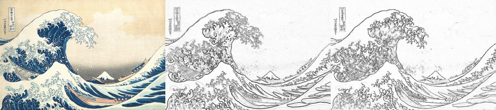

# sketchKeras-pytorch

Unofficial implementation of [sketchKeras](https://github.com/lllyasviel/sketchKeras) in pytorch. sketchKeras is for extracting the sketch from a painting.  
I translated the original implementation in keras to the pytorch code and also converted the weight file. 

## Usage
Place the weight file in `weights` directory.  
The weight file can be downloaded [here](https://drive.google.com/file/d/1Zo88NmWoAitO7DnyBrRhKXPcHyMAZS97/view?usp=sharing).

For processing, run the following command.
```sh
python src/test.py -i [TEST.JPG] -o [OUTPUT.JPG]
```

If you are interested in the way to convert the weight file of the original implementation to this project, see `src/fromkeras.py`

## Examples
First column : original image  
Second column : edge image extracted by Sobel filter  
Third column : result of sketchKeras


(Original image from https://safebooru.org/index.php?page=post&s=view&id=1234461)

(Original image from https://www.metmuseum.org/art/collection/search/45434?searchField=All&amp;sortBy=Relevance&amp;ft=Katsushika+Hokusai&amp;offset=0&amp;rpp=20&amp;pos=1)

(Original image from https://safebooru.org/index.php?page=post&s=view&id=3066528)

## (My) Environments
- python (3.7.7)
- numpy
- torch (1.6.0)
- opencv-python (4.4.0.42)