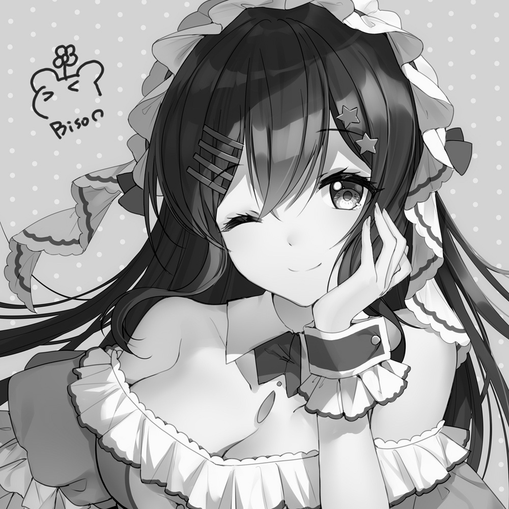

# sketchKeras-pytorch

Unofficial implementation of [sketchKeras](https://github.com/lllyasviel/sketchKeras) in pytorch. sketchKeras is for extracting the sketch from a painting.  
I translated the original implementation in keras to the pytorch code and also converted the weight file. 

## Usage
Place the weight file in `weights` directory.  
The weight file can be downloaded [here](https://drive.google.com/file/d/1Zo88NmWoAitO7DnyBrRhKXPcHyMAZS97/view?usp=sharing).

For processing, place the pictures in folder 'read' and then run the following command.
```sh
python main.py
```

Explanation of some args.

    '--ratio', type=float, default=0.95,
    The rate one pictures will be placed in 'train' folder. Otherwise it will be used as val.


    '--size_limit', type=int, default=1536,
    If the resolution of the image is too high, the image will be resized to a proper size around this number.
If you are interested in the way to convert the weight file of the original implementation to this project, see `src/fromkeras.py`

## Examples
This program works with pictures at ANY resolution. (Pictrues are from Internet. If there is a copyright infringement, please contact me to delete them.)

First: original image  
Second: gray image  
Third: result of sketchKeras





## (My) Environments
- python (3.7.7)
- numpy
- torch (1.6.0)
- opencv-python (4.4.0.42)